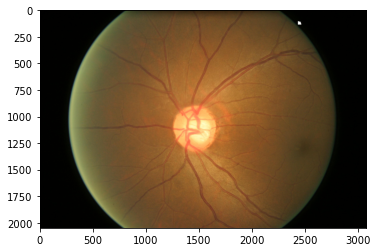
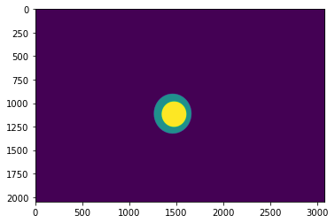
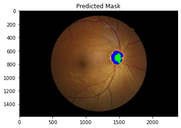
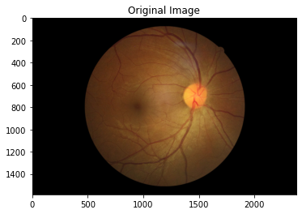
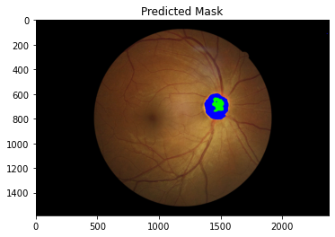

# Aravind Preliminary Task

## Task Description

  Glaucoma is a disease in the eye where elevated pressure causes eye damage. Due to the pressure, the optic nerve does not function properly and can lead to permanent loss of vision. However, the disease can be treated if detected at its early stages since the disease progresses very slowly. Current diagnostic tests are not the most efficient. The most common method used is tonography, a diagnostic test which records the eye pressure over a 4-minute period. 

  New research has shown that a diagnosis can be made by just using the fundus image using deep learning algorithms. Good results have been produced, however, not much research has been done which includes multiple sources of data. Limiting the dataset to one source can introduce bias and limits the number of images used for training. My goal was to create a model that uses data from several resources and create a full testing pipeline to perform a diagnosis. 

## Methods

  To start the project off, we were given 650 images from the ORIGA database. However, the number of images in this single dataset is too few to create a model without overfitting. To add more images, I introduced two new datasets with fundus images. This made a total of three datasets which also reduced the chance of overfitting and prevented any bias from a single source. 
  
  **Sources Used**
  * ORIGA (168 Glaucoma, 482 Normal)
  * [ACRIMA](https://figshare.com/s/c2d31f850af14c5b5232) (396 Glaucoma, 309 Normal)
  * [G1020](http://www.dfki.de/SDS-Info/G1020/) (296 Glaucoma, 724 Normal)
  
  Using the additional databases, increased the number of images from 650 to 2,375 with the Glaucoma Images making up approximately 36.2% of all data. This slight imbalance was addressed during the training and I include the AUC score as an evaluation metric. Before I could train the classification model, I performed an image segmentation task. 
  
### Cropping

The fundus images from the 3 datasets come in two forms. Some include the full fundus image, while others include solely the optic disc. According to the paper below, glaucoma affects mainly the optic disc and its nearby surroundings. In fact, they proved that it was more effective to use just the optic disc than to use the full fundus image. This gives the Convolutional Neural Network model one specific area to look at.

  >Orlando JI, Prokofyeva E, del Fresno M, Blaschko MB. Convolutional neural network transfer for automated glaucoma identification. In: SPIE proceedings. 2017, p. 10160–10. https://doi.org/10.1117/12.2255740
  
  The optic disc carries a lot of importance when diagnosing glaucoma since it gives information on the cup to disc ratio. The images below show a side by side comparison of the original fundus image with the segmentation labels given. The blue color represents the optic disk and the yellow represents the optic cup. The ratio of these colors is supposed to be a significant factor in the diagnosis process.
 

However, according to the paper below, it is extremely difficult to get even an approximately accurate ratio. Instead, we crop the image around the optic disk so that the convolutional neural network can still detect important features from this region. 

  >Diaz-Pinto, A., Morales, S., Naranjo, V. et al. CNNs for automatic glaucoma assessment using fundus images: an extensive validation. BioMed Eng OnLine 18, 29 (2019). https://doi.org/10.1186/s12938-019-0649-y
  
### Segmentation Model

The model I built to perform the segmentation was a U-net architecture. The segmentation was trained on the 650 images from the ORIGA dataset, since the other two sources did not provide labels for the masks. 

#### Preprocessing

From a simplistic point of view, the segmentation model is supposed to detect the small circular area in the center. This has nothing to do with the nerves in the image. Therefore, I used an algorithm to remove the nerves as much as possible. Of course, when doing the actual classification, the nerves play an important role, however, for the purpose of segmentation, they are simply extra noise in the image. 
```python
def remove_nerves(image):
    img = array_to_img(image)
    
    img = cv2.cvtColor(np.array(img), cv2.COLOR_BGR2RGB)
    # convert image to grayScale
    grayScale = cv2.cvtColor(img, cv2.COLOR_RGB2GRAY)
   
    # kernel for morphologyEx
    kernel = cv2.getStructuringElement(1,(17,17))
   
    # apply MORPH_BLACKHAT to grayScale image
    blackhat = cv2.morphologyEx(grayScale, cv2.MORPH_BLACKHAT, kernel)
  
    # apply thresholding to blackhat
    _,threshold = cv2.threshold(blackhat,10,255,cv2.THRESH_BINARY)

    # inpaint with original image and threshold image
    final_image = cv2.inpaint(img,threshold,1,cv2.INPAINT_TELEA)
    final_image = cv2.cvtColor(final_image, cv2.COLOR_BGR2RGB)
    
    return final_image.astype(np.float64)/255.0
```

Here is a step by step image diagram that shows how the nerves are hidden.


Note: This method has been repurposed from a hair removal method for melanoma diagnosis.

The final image clearly hides the nerves a little. Since they still play an important role in classification, they are added back to full resolution when preparing the data for classification. The following pictures show the difference it made to remove the nerves.

Prediction Before Nerve Removal       |  Full Image     | Prediction After Nerve Removal
:-------------------------:|:-------------------------:|:-------------------------:
  |     | 

Removing the nerves from the fundus image resulted in a slightly more accurate segmentation.

