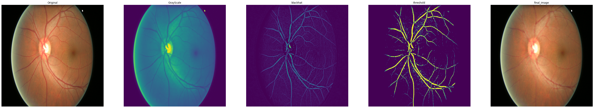

# Aravind Preliminary Task

## Task Description

  Glaucoma is a disease in the eye where elevated pressure causes eye damage. Due to the pressure, the optic nerve does not function properly and can lead to permanent loss of vision. However, the disease can be treated if detected at its early stages since the disease progresses very slowly. Current diagnostic tests are not the most efficient. The most common method used is tonography, a diagnostic test which records the eye pressure over a 4-minute period. 

  New research has shown that a diagnosis can be made by just using the fundus image using deep learning algorithms. Good results have been produced, however, not much research has been done which includes multiple sources of data. Limiting the dataset to one source can introduce bias and limits the number of images used for training. My goal was to create a model that uses data from several resources and create a full testing pipeline to perform a diagnosis. 

## Methods

  To start the project off, we were given 650 images from the ORIGA database. However, the number of images in this single dataset is too few to create a model without overfitting. To add more images, I introduced two new datasets with fundus images. This made a total of three datasets which also reduced the chance of overfitting and prevented any bias from a single source. 
  
  **Sources Used**
  * ORIGA (168 Glaucoma, 482 Normal)
  * [ACRIMA](https://figshare.com/s/c2d31f850af14c5b5232) (396 Glaucoma, 309 Normal)
  * [G1020](http://www.dfki.de/SDS-Info/G1020/) (296 Glaucoma, 724 Normal)
  
  Using the additional databases, increased the number of images from 650 to 2,375 with the Glaucoma Images making up approximately 36.2% of all data. This slight imbalance was addressed during the training and I include the AUC score as an evaluation metric. Before I could train the classification model, I performed an image segmentation task. 
  
### Cropping

The fundus images from the 3 datasets come in two forms. Some include the full fundus image, while others include solely the optic disc. According to the paper below, glaucoma affects mainly the optic disc and its nearby surroundings. In fact, they proved that it was more effective to use just the optic disc than to use the full fundus image. This gives the Convolutional Neural Network model one specific area to look at.

  >Orlando JI, Prokofyeva E, del Fresno M, Blaschko MB. Convolutional neural network transfer for automated glaucoma identification. In: SPIE proceedings. 2017, p. 10160–10. https://doi.org/10.1117/12.2255740
  
  The optic disc carries a lot of importance when diagnosing glaucoma since it gives information on the cup to disc ratio. The images below show a side by side comparison of the original fundus image with the segmentation labels given. The blue color represents the optic disk and the yellow represents the optic cup. The ratio of these colors is supposed to be a significant factor in the diagnosis process.
  
 

However, according to the paper below, it is extremely difficult to get even an approximately accurate ratio. Instead, we crop the image around the optic disk so that the convolutional neural network can still detect important features from this region. 

  >Diaz-Pinto, A., Morales, S., Naranjo, V. et al. CNNs for automatic glaucoma assessment using fundus images: an extensive validation. BioMed Eng OnLine 18, 29 (2019). https://doi.org/10.1186/s12938-019-0649-y
  
### Segmentation Model

The model I built to perform the segmentation was a U-net architecture. The segmentation was trained on the 650 images from the ORIGA dataset, since the other two sources did not provide labels for the masks. 

#### Preprocessing
The first preprocessing step I did was resizing everything to a 512x512 sized image/mask. Then I used some more advanced techniques. 

From a simplistic point of view, the segmentation model is supposed to detect the small circular area in the center. This has nothing to do with the nerves in the image. Therefore, I used an algorithm to remove the nerves as much as possible. Of course, when doing the actual classification, the nerves play an important role, however, for the purpose of segmentation, they are simply extra noise in the image. 
```python
def remove_nerves(image):
    img = array_to_img(image)
    
    img = cv2.cvtColor(np.array(img), cv2.COLOR_BGR2RGB)
    # convert image to grayScale
    grayScale = cv2.cvtColor(img, cv2.COLOR_RGB2GRAY)
   
    # kernel for morphologyEx
    kernel = cv2.getStructuringElement(1,(17,17))
   
    # apply MORPH_BLACKHAT to grayScale image
    blackhat = cv2.morphologyEx(grayScale, cv2.MORPH_BLACKHAT, kernel)
  
    # apply thresholding to blackhat
    _,threshold = cv2.threshold(blackhat,10,255,cv2.THRESH_BINARY)

    # inpaint with original image and threshold image
    final_image = cv2.inpaint(img,threshold,1,cv2.INPAINT_TELEA)
    final_image = cv2.cvtColor(final_image, cv2.COLOR_BGR2RGB)
    
    return final_image.astype(np.float64)/255.0
```

Here is a step by step image diagram that shows how the nerves are hidden.



**Note:** This method has been repurposed from a hair removal method for melanoma diagnosis.

The final image clearly hides the nerves a little. Since they still play an important role in classification, they are added back to full resolution when preparing the data for classification. The following pictures show the difference it made to remove the nerves.

Prediction Without Nerve Removal       |  Full Image     | Prediction With Nerve Removal
:-------------------------:|:-------------------------:|:-------------------------:
  |     | 

**Note:** This image was not part of the training set!

Removing the nerves from the fundus image resulted in a slightly more accurate segmentation. 

After preprocessing the image, I built a U-net using tensorflow's mobilenet architecture. To accomplish the task with a simple API, I installed tensorflow's pix2pix library. This was a small library created to help with upsampling convolutional layers. 

### Training

Training this model was a little difficult because of the class imbalance (almost all are background pixels). When I trained with simple categorical cross-entropy, the model predicted the background class for everything. Later, I used the same model with a multiclass soft-dice loss. The implementation that I used also ignored the first class which was the background class in my case. This gave me much better results. 

### Cropping Technique

Once I had the segmentation for each image, I was ready to crop them at the desired location. My segmentation separated the fundus image into three classes: background (0), optic disc (1), optic cup (2). For each image, I iterate through the pixels and find the average x and y coordinates of the pixels marked as 1/optic disc and 2/optic cup. After getting this center point, I cropped out a square region with this point as the center. The size of the cropped region was adjusted based on the size of the overall image. 

Full Image       |  Cropped Region
:-------------------------:|:-------------------------:
  |  

**Note**: This image is not from the train set.

This cropping technique was applied to every image in the ORIGA and G1020 datasets. The ACRIMA dataset contained images that had already been cropped so they did not need to be processed any further. Going through each image from the two datasets and cropping them took about 6 to 7 hours since it had to be run through the model and cropped. After this was done, I stored each image in a folder based on which class (Glaucoma or Healthy) they belonged to. Code for this is in ```3d. Create Cropped Images.ipynb```.

At the end, I had to filter out some of the cropped images since they were not predicted correctly by the u-net. Here is an example of one such image:


It is clear that there is no optic disc shown in the cropped region. These types of images were filtered out. After removing all of these images, 2,272 images remained in the cummalative dataset. Exactly 103 images were removed.

## Classification Model

Before doing any image segmentation or adding additional datasets, I created a simple baseline model with just the 650 original images. Of course, this did not perform very well due to the extremely low number of images. Furthermore, the model was taking in the entire fundus image as input instead of just the optic disc region. The code for the baseline model is found in ```2. Baseline Model - No Cropping.ipynb```. This model was extremely difficult to evaluate since the validation set consisted of very few images. As a result, the validation accuracy and AUC score fluctuated. However, generally, the AUC score was near or below 50% (50 is the base score). 

The final model ```4. Final Model - With Cropping.ipynb``` resulted in much better results. These were trained on the cropped dataset with 2,272 images. I received the best results using the **InceptionV3** model pre-trained on imagenet with zero frozen layers. The model was trained using a learning rate of 1e-4 and Stochastic Gradient Descent optimizer. Originally, I trained the model using binary_crossentropy, however, due to the imbalance (30% Glaucoma, 70% Healthy), the AUC score was staying around 50 again. 

To solve this issue, I switched to a weighted binary cross entropy which significantly increased the AUC and accuracy scores. The model usually reached a maximum AUC score of 69 to 70 on the validation (much better than before) and then started overfitting the train dataset. To stop once overfitting began, I created the following callback:

```python

class myCallback(tf.keras.callbacks.Callback):
    def on_epoch_end(self, epoch, logs={}):
        if(logs.get('val_accuracy')>0.7):
            print("\nReached 70% accuracy so cancelling training!")
            self.model.stop_training = True
        if (logs.get('val_auc') > 0.69):
            print("\nReached 70% AUC score so cancelling training!")
            self.model.stop_training = True
```
This callback stopped training once either the validation accuracy reached 70% or the AUC reached 69%. In the medical context, I was more worried about AUC. If a person gets diagnosed with Glaucoma, but they actually don't have it, then they can still take precaution. However, it is mroe dangerous if there is a false negative (has Glaucoma but diagnosed as Healthy) because the patient with Glaucoma will not take any further action. For this reason, it is important to be cautious about the AUC rather than simple accuracy. 
